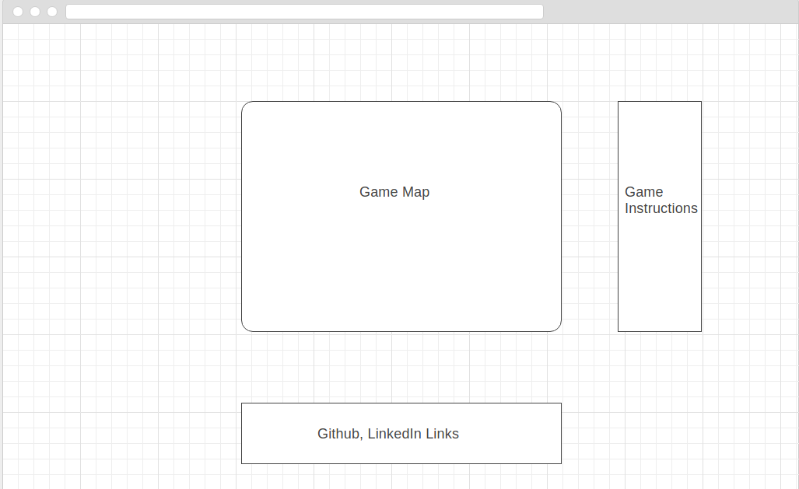

## The Legend of Zelda: Link's Escape

### Background

The Legend of Zelda: Link's Escape is based on the classic Nintendo series. In this version you will be stuck inside a room with various enemies. You will need to fight them off in order to advance to the next level. Each level will be harder than the last, with faster and tougher enemies.  To win the game you will need to beat every level. If you get hit by an enemy you will get a game over.

### Functionality & MVP

In this game, player's will be able to:

- [ ] Fight various enemies
- [ ] Move around the different levels
- [ ] Use two different attacks

In addition, this project will include:

- [ ] A side bar with the game's instructions
- [ ] A production README.md

### Wireframe

### Architecture and Technologies

This project will be implemented with the following technologies:

- `JavaScript` will be used for game's logic.
- `Canvas` for the art and animation rendering.
- `Webpack` to bundle JS files.

### Implementation Timeline

**Day 1**: Setup all the necessary files: node modules and webpack. Research on how to utilize Canvas for the project.

Goals for the day:

- Setup entry file.
- Be able to render the map and some sprites.

**Day 2**: Keep on getting familiarized with Canvas. Also Start building out the game's logic.

Goals for the day:

- Write the game's combat logic.
- Render the different characters on-screen.

**Day 3**: Complete the enemy AI. Have a playable game where the player can kill enemies and enemies can kill the player.

Goals for the day:

- Finish touching up the game's combat logic and animations.
- Have background music.
